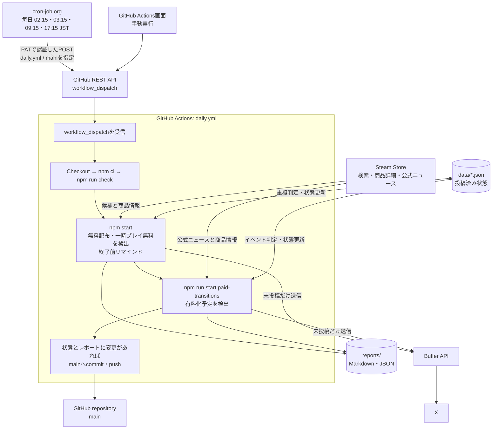

# free-to-keep-game-radar

日本向けゲームストアの無料キャンペーンを見つけてXへ投稿するBotです。無料で入手して終了後も遊べる配布と、期間中だけ遊べる一時プレイ無料を区別して告知します。

現在はSteamに対応し、次の3種類を監視しています。

- 有料ゲームの期間限定無料配布（100%割引）
- 有料ゲームを期間中だけ遊べる一時プレイ無料
- 現在は無料だが、今後有料化されるゲーム

cron-job.orgからGitHub Actionsを定期起動し、検出、投稿、状態更新、実行レポートの保存を行います。

## システム構成



cron-job.orgが行うのは、GitHub REST APIへリクエストを送り、`workflow_dispatch`による実行を作成するところまでです。APIが成功を返した後、実際の検出や投稿はGitHub Actions上で非同期に進みます。そのため、cron-job.orgの成功は「GitHub Actionsの起動受付に成功した」ことを示し、検出・投稿処理の最終結果はGitHub Actionsの実行履歴で確認します。

GitHub ActionsはSteamから取得した情報と`data/*.json`の保存済み状態を比較し、未投稿の情報だけをBuffer経由でXへ送信します。最後に更新した状態と実行レポートを`main`へ保存します。

## 投稿例

### 期間限定無料配布

```text
無料配布🎁

『ゲームタイトル』
¥1,200 → 無料（100% OFF）
⏰ 10/8 09:00まで

https://store.steampowered.com/app/000000/

#ゲーム無料配布 #Steam #もろとこ
```

### 有料化予定

```text
もうすぐ有料⚠️

『ゲームタイトル』
現在無料 → 10月13日以降に有料化予定

https://store.steampowered.com/app/000000/

#ゲーム無料配布 #Steam #もろとこ
```

### 一時プレイ無料

```text
一時プレイ無料🎮

『ゲームタイトル』
期間限定で無料プレイ
⏰ 10/5 09:00〜10/8 09:00

気になってたゲームを、この機会に遊んでみよう！

https://store.steampowered.com/app/000000/

#ゲーム無料プレイ #Steam #もろとこ
```

### 終了前リマインド

```text
まもなく終了⏰

『ゲームタイトル』
無料配布は 10/8 09:00まで

ライブラリへの追加忘れに注意！

https://store.steampowered.com/app/000000/

#ゲーム無料配布 #Steam #もろとこ
```

有料化の正確な日付が発表されていない場合は「近日中に有料化予定」と表示します。投稿内の日付と時刻はすべて日本標準時（JST）で表示します。投稿文はXの加重文字数上限を計算し、必要な場合はゲームタイトルだけを書記素単位で省略します。URLとハッシュタグは必ず残ります。

公式発表に「リリース後30日間」のような相対的な無料期間が記載されている場合は、日付へ推定変換せず「リリース後30日間は無料 → その後有料化予定」のように原文の意味を保って告知します。

## 検出条件

### 期間限定無料配布

以下をすべて満たすSteam商品を対象にします。

- 商品種別がゲーム
- 通常価格が0より大きい
- 現在価格が0
- 割引率が100%
- 常時無料（Free to Play）ではない
- 日本向けSteamストアで取得可能

通常の100%値引きに加え、通常価格を持つゲームに別の無料配布パッケージが用意される方式も対象です。この方式では、無料ライセンスのパッケージIDと商品ページの取得フォームが一致し、終了後も保持できると明記されていることを確認します。`appdetails.is_free` だけで常時無料かどうかを判断しません。

デモ、DLC、常時無料ゲームは除外します。

### 一時プレイ無料

Steamの無料候補検索に加え、日本向けトップページの特集・おすすめ（`featuredcategories`）から購入価格のある候補も取得します。商品データに一時プレイ中であることが明示されたうえで、以下をすべて満たす商品を対象にします。

- 商品種別がゲーム
- 通常価格が0より大きい有料ゲーム
- 商品詳細上の現在価格が0より大きい
- 常時無料（Free to Play）ではない
- 日本向けSteamストアで取得可能

無料週末の期間が明示されている場合、開始前・終了後のイベントは除外します。一時プレイ無料は所有権を獲得する無料配布とは区別し、終了後も遊ぶには購入が必要であることを告知します。

候補収集はSteam検索と特集掲載に依存するため、いずれにも掲載されないキャンペーンの網羅は保証できません。

### 有料化予定

Steam公式ニュースを有料化に関する複数の表現で検索し、見つかったゲームの商品情報とニュース本文を再検証します。以下をすべて満たす場合だけ投稿します。

- 商品種別がゲーム
- 日本向けSteamストアで現在無料
- 公式ニュースに無料から有料へ移行する旨が記載されている
- 無料期間中の取得者が、有料化後もアクセスを保持できると明記されている

公式発表は、公式アナウンスのフィード情報とSteamの配信URLを確認します。Steam自身のニュース中継URLも対象ですが、外部メディアのフィードは対象外です。否定・撤回・DLCのみの変更などは告知せず、有料化日もゲーム本体の有料化を述べた文から取得します。意味や日付を確定できない場合は推測しません。

検索から新しく検出する場合は、30日以内の公式ニュースを対象にします。一度検出した有料化イベントは、実際に有料化されるまで継続して確認します。

## 処理の流れ

cron-job.orgから毎日00:15・08:15・17:15・18:15（UTC）にGitHub Actionsを起動し、次の順番で実行します。日本時間では09:15・17:15・翌02:15・翌03:15です。17:15・18:15（UTC）の2回は、Steamの標準更新時刻である10:00（America/Los_Angeles）の夏時間と冬時間をそれぞれカバーします。

1. Steam Storeから100%割引候補と一時プレイ無料候補を取得
2. 商品詳細を使ってそれぞれの条件を再検証
3. 未投稿のキャンペーンをXへ投稿
4. 終了まで12時間以内の投稿済みキャンペーンを一度だけ再告知
5. 期間限定無料配布の処理完了後、Steam公式ニュースから有料化予定を探索
6. 未投稿の有料化告知をXへ投稿
7. 状態をリポジトリへ保存し、実行レポートをGitHub Actions artifactへ保存

GitHub Actions側にはスケジュールを定義せず、手動実行とcron-job.orgからの`workflow_dispatch`だけを受け付けます。

投稿状態をリポジトリ内に保持し、送信の再試行時は投稿本文・キャンペーン開始日時・チャンネルを照合します。同じURLでも、過去の配布や別種別の告知を今回の送信済み投稿として扱いません。受付後はBufferの投稿IDを保存し、そのIDで送信結果を確認します。有料化予定はApp ID単位のイベントとして管理し、複数の続報が公開されても再投稿せず、関連ニュースとして同じイベントへ記録します。実際に有料化された後、再び無料化されて新しい有料化告知が出た場合だけ、次の世代のイベントとして扱います。

Bufferへの受付とXへの送信完了は区別します。受付済みは `submitted`、送信結果が不明な場合は `uncertain` とし、`sent` と確認できた場合だけ投稿成功として記録します。初回告知・有料化告知・終了前リマインドのいずれも、送信要求前に状態を保存します。受付済みの投稿は、キャンペーンが検出されなくなった後も確認します。

結果不明の投稿を自動で再作成すると二重投稿になるため、履歴に見つからない場合や送信失敗が確認された場合はエラーを記録します。現在の照合範囲は直近100件です。運用者はレポートのBuffer投稿ID・保存済み本文・状態を確認し、Buffer側で配信結果を確認してから状態の復旧や再送を判断してください。既存の投稿済み状態はそのまま引き継ぎます。

検索応答の必須項目が欠けている場合や探索上限に達した場合は、正常な0件として扱いません。不完全な検索では、既存キャンペーンの未検出回数を増やしません。HTTPのタイムアウトは本文取得まで適用します。

終了日時は対象の購入パッケージに対応する欄からのみ取得し、複数の異なる期限があれば不明として扱います。商品ページ内の関連商品や通常セールの期限で代用しません。

終了日時を取得できたキャンペーンは、終了まで12時間以内になった最初の実行で一度だけリマインドします。同じ実行で初回告知とリマインドが連続しないよう、実行開始前から投稿済みだったキャンペーンだけを対象にします。

## ディレクトリ構成

```text
.
├─ .github/workflows/       GitHub Actions
├─ data/                    検出対象と重複投稿防止の状態
├─ reports/                 期間限定無料配布の実行レポート
│  └─ paid-transitions/     有料化予定の実行レポート
├─ src/
│  ├─ providers/            ストアごとの検出処理
│  └─ publishers/           投稿処理
└─ tests/                   単体テスト
```

## レポート

各実行についてMarkdownとJSONを作成し、GitHub Actions artifactへ30日間保存します。新規検出、投稿試行、またはエラーがあった実行だけは、追跡しやすいようリポジトリにも保存します。既存レポートは上書きしません。

```text
reports/YYYY/MM/YYYY-MM-DD_HHMMSS_JST_run-RUN_ID_attempt-N.md
reports/YYYY/MM/YYYY-MM-DD_HHMMSS_JST_run-RUN_ID_attempt-N.json

reports/paid-transitions/YYYY/MM/YYYY-MM-DD_HHMMSS_JST_run-RUN_ID_attempt-N.md
reports/paid-transitions/YYYY/MM/YYYY-MM-DD_HHMMSS_JST_run-RUN_ID_attempt-N.json
```

レポートには実行日時、検出件数、投稿結果、検出商品、エラーを記録します。認証情報や外部サービスのレスポンス全文は保存しません。

## 障害通知

GitHub ActionsのRepository secretに`DISCORD_WEBHOOK_URL`を設定すると、検出、投稿、状態保存などでworkflowが失敗した際にDiscordへ実行URLを通知します。cron-job.orgからGitHub Actionsを起動できなかった場合はworkflow自体が開始されないため、その障害はcron-job.org側の失敗通知で監視します。

## 開発

Node.js 22以降が必要です。

```shell
npm ci
npm run check
```

主なコマンド：

```shell
npm start                         # 期間限定無料配布を検出
npm run start:paid-transitions    # 有料化予定を検出
npm test                          # 単体テスト
npm run typecheck                 # 型チェック
```

ローカル実行では、明示的に有効化しない限りXへ投稿しません。

## 技術上の注意

Steam Store検索と`appdetails`はSteamストアが利用する公開エンドポイントですが、安定した製品APIとして保証されたものではありません。レスポンスやHTML構造の変更により検出処理の更新が必要になる場合があります。

このBotは無料取得や購入を自動実行しません。配布条件や終了日時は変更される可能性があるため、取得前に必ずストアページを確認してください。
